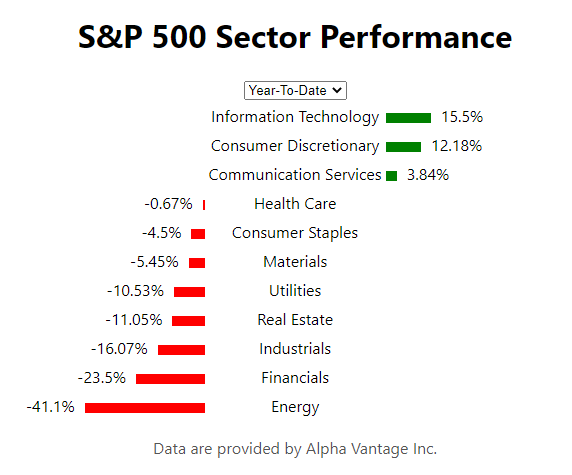

## S&P 500 Sector Performance

Небольшое React приложение, которое отображает изменение индексов 11 секторов S&P 500 на различных таймфреймах. Данные обновляются в реальном времени с периодичностью порядка 30 секунд c использованием Alpha Vantage API. Написано в целях ознакомления с React Hooks API.

[Live Demo](https://hazuwall.github.io/SP500-Performance/)

## Установка

npm install

## Использование

npm start
